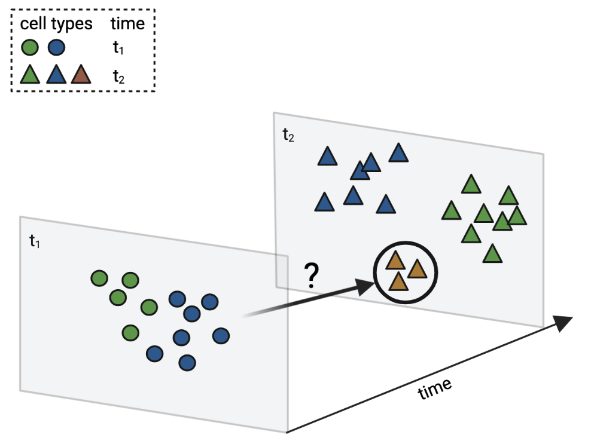
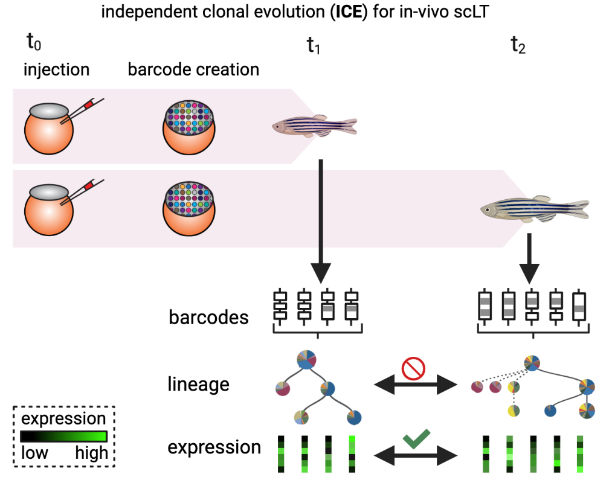
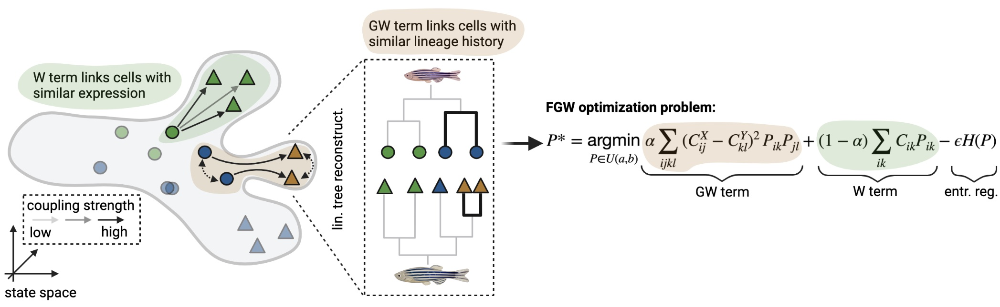

Mapping lineage-traced cells across time points with moslin
===========================================================

   `moslin` is an algorithm to map lineage-traced single cells across time points. Our algorithm combines gene expression with lineage information at all time points to reconstruct precise differentiation trajectories in complex biological systems. See the `tutorial`_ to learn more.

moslin's key applications
-------------------------
- Probabilistically map cells across time points in lineage-traced single-cell RNA-sequencing (scRNA-seq) studies.
- Infer ancestors and descendants of rare or transient cell types or states.
- Combine with  `CellRank <https://cellrank.org>`_ to compute putative driver genes, expression trends, activation cascades, and much more.

The moslin algorithm
--------------------
High-diversity lineage relationships can be recorded using evolving barcoding systems (`Wagner and Klein, Nat Rev Genet 2020 <https://doi.org/10.1038/s41576-020-0223-2>`_);
when applied in-vivo, these record independent lineage relationships in each individual. To infer the molecular
identity of putative ancestor states, samples need to be related from early to late time points.

   **Mapping independent clonal evolution**: evolving lineage recording systems, based on, e.g., Cas-9 induced genetic scars (`Alemany et al., Nature 2018 <https://doi.org/10.1038/nature25969>`_, `Raj et al., Nature Biotech 2018 <https://doi.org/10.1038/nbt.4103>`_, `Spanjaard et al., Nature Biotech 2018 <https://doi.org/10.1038/nbt.4124>`_), record independent clonal evolution in each individual.

In our setting, each individual corresponds to a different time point, and we wish to relate cells across time to infer precise differentiation trajectories ( `Forrow and Schiebinger, Nature Comms 2021 <https://doi.org/10.1038/s41467-021-25133-1>`_). While gene expression is directly comparable across time points, lineage information is not: individual lineage trees may be reconstructed at each time point
(`Alemany et al., Nature 2018 <https://doi.org/10.1038/nature25969>`_, `Raj et al., Nature Biotech 2018 <https://doi.org/10.1038/nbt.4103>`_, `Spanjaard et al., Nature Biotech 2018 <https://doi.org/10.1038/nbt.4124>`_, `Jones et al., Genome Biology 2020 <https://doi.org/10.1186/s13059-020-02000-8>`_), but these do not uncover the molecular identity of putative ancestors or descendants.

   **The moslin algorithm**: the grey outline represents a simplified state manifold, dots and triangles illustrate early and late cells, respectively, and colors indicate cell states.

Critically, `moslin` uses two sources of information to map cells across time in an optimal transport (OT) formulation (`Peyré and Cuturi, arXiv 2019 <http://arxiv.org/abs/1803.00567>`_):

- **gene expression**: directly comparable across time points, included in a Wasserstein (W)-term (`Schiebinger et al., Cell 2019 <https://doi.org/10.1016/j.cell.2019.01.006>`_). The W-term compares individual early and late cells and seeks to minimize the distance cells travel in phenotypic space.
- **lineage information**: not directly comparable across time points, included in a Gromov-Wasserstein (GW)-term (`Nitzan et al., Nature 2019 <https://doi.org/10.1038/s41586-019-1773-3>`_, `Peyré et al., PMLR 2016 <http://proceedings.mlr.press/v48/peyre16.pdf>`_). The GW-term compares pairwise early and late cells and seeks to maximize lineage concordance.

We combine both sources of information in a Fused Gromov-Wasserstein (FGW) problem (`Vayer et al., Algorithms 2020 <https://doi.org/10.3390/a13090212>`_), a type of OT-problem. Additionally, we use entropic regularization (`Cuturi 2013 <https://proceedings.neurips.cc/paper/2013/hash/af21d0c97db2e27e13572cbf59eb343d-Abstract.html>`_) to speed up computations and to improve the statistical properties of the solution (`Peyré and Cuturi, arXiv 2019 <http://arxiv.org/abs/1803.00567>`_).

Code, tutorials and data
-------------------------
Under the hood,
moslin is based on `moscot`_ to solve the optimal transport problem of mapping
lineage-traced cells across time points. Specifically, we implement moslin via the
`LineageClass`_ , we demonstrate a use case in our `tutorial`_ and we showcase
how to work with `tree distances`_ in an example. Downstream analysis, like
`visualizing`_ the inferred cell-cell transitions, is available via moscot's API.

Raw published data is available from the Gene Expression Omnibus (GEO) under accession codes:

- `c elegans`_: `GSE126954 <https://www.ncbi.nlm.nih.gov/geo/query/acc.cgi?acc=GSE126954>`_.
- `zebrafish`_: `GSE159032  <https://www.ncbi.nlm.nih.gov/geo/query/acc.cgi?acc=GSE159032>`_.

Additionally, we simulated data using `LineageOT`_ and `TedSim`_. Processed data
is available on `figshare`_. To ease reproducibility, our data examples can
also be accessed through moscot's `dataset interface <https://moscot.readthedocs.io/en/latest/user.html#module-moscot.datasets>`_.

Reproducibility
---------------
To ease reproducibility of our preprint results, we've organized this repository along the categories below. Each folder contains
notebooks and scripts necessary to reproduce the corresponding analysis. We read data from `data <data/>`_
and write figures to `figures <figures/>`_. Please open an `issue <https://github.com/theislab/moslin/issues/new>`_ should you experience
difficulties reproducing any result.

Results
-------

.. csv-table::
   :header: "Application", "Folder path"

    Simulated data (Fig. 2), `analysis/simulations/ <analysis/simulations/>`__
    C elegans embryogenesis (Fig. 3), `analysis/packer_c_elegans/ <analysis/packer_c_elegans/>`__
    Zebrafish heart regeneration (Fig. 4), `analysis/hu_zebrafish_linnaeus/ <analysis/hu_zebrafish_linnaeus/>`__

The concept figures in this README have been created with BioRender. 

.. _moscot: https://moscot-tools.org/
.. _LineageClass: https://moscot.readthedocs.io/en/latest/genapi/moscot.problems.time.LineageProblem.html
.. _tree distances: https://moscot.readthedocs.io/en/latest/notebooks/examples/problems/600_leaf_distance.html
.. _tutorial: https://moscot.readthedocs.io/en/latest/notebooks/tutorials/100_lineage.html
.. _downstream analysis:
.. _LineageOT: https://doi.org/10.1038/s41467-021-25133-1
.. _TedSim: https://doi.org/10.1093/nar/gkac235
.. _c elegans: https://doi.org/10.1126/science.aax1971
.. _zebrafish: https://doi.org/10.1038/s41588-022-01129-5
.. _visualizing: https://moscot.readthedocs.io/en/latest/user.html#module-moscot.plotting
.. _figshare: https://doi.org/10.6084/m9.figshare.c.6533377.v1
